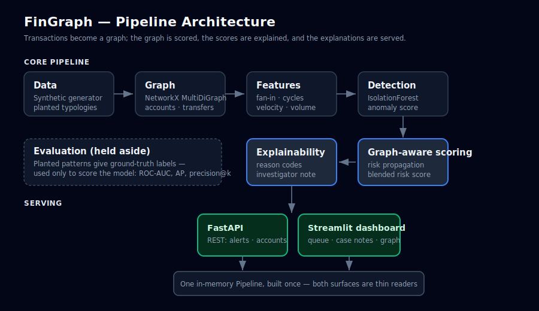

# FinGraph

**Graph-based detection and explanation of suspicious financial activity.**

FinGraph models transactions as a graph, scores every account for money-laundering
risk using both anomaly detection and graph-aware risk propagation, and — critically —
explains *why* each account was flagged in plain language an investigator can act on.


---

## Why this matters

Money laundering rarely looks suspicious one transaction at a time. It hides in
*structure*: many small deposits funnelled into one account (structuring), funds
pushed rapidly through chains to obscure their origin (layering), or money routed
in a loop back to its source (cycles). Row-by-row analysis misses all of these.
Modeling transactions as a graph makes them visible.

But detection alone isn't enough in a regulated environment. An alert that says
"risk = 0.94" with no justification is useless to a compliance analyst and
indefensible to a regulator. FinGraph pairs every score with traceable evidence
and a readable case note, so an alert becomes an investigation.

## Results

Measured on the default synthetic dataset (500 accounts, ~6,100 transactions,
fixed seed for reproducibility). Ground-truth labels come from planted laundering
patterns and are used only for evaluation, never for training.

| Metric            | Anomaly baseline | + Graph-aware scoring |
|-------------------|------------------|-----------------------|
| ROC-AUC           | 0.855            | **0.889**             |
| Average precision | 0.703            | **0.747**             |
| Precision@20      | 1.00             | **1.00**              |

Propagating risk along the transaction graph improves ranking quality over a
standalone anomaly detector — the lift comes from catching pass-through accounts
whose own features look ordinary but whose *company* is suspicious.

## How it works



1. **Data** — a seeded synthetic generator produces retail-bank traffic with
   planted structuring, layering, and cycle typologies.
2. **Graph** — accounts become nodes, transactions become directed edges
   (NetworkX `MultiDiGraph`).
3. **Features** — per-account signals spanning volume, velocity, and structure
   (fan-in, cycle membership, burst timing).
4. **Detection** — an unsupervised IsolationForest scores each account.
5. **Graph-aware scoring** — risk propagates along edges, so accounts that deal
   with suspicious accounts become suspicious themselves; blended with the
   anomaly score.
6. **Explainability** — typed reason codes and a plain-English case note for
   every flagged account.
7. **Serving** — a FastAPI service and a Streamlit investigator dashboard, both
   reading from one in-memory pipeline.

## Demo


The neighbourhood graph makes structure literal — here a high-risk collector with
heavy fan-in:


## Quickstart

```bash
git clone https://github.com/<you>/fingraph.git
cd fingraph
python3 -m venv .venv && source .venv/bin/activate
pip install -e ".[dev,api,dashboard]"
```

### Run the dashboard
```bash
streamlit run src/fingraph/dashboard/app.py
```

### Run the API
```bash
uvicorn fingraph.api.app:app --reload
# interactive docs at http://127.0.0.1:8000/docs
```

### Run the pipeline from the terminal
```bash
python -m fingraph.scoring.run_scoring        # baseline vs graph-aware metrics
python -m fingraph.explain.run_investigation  # case notes for top accounts
```

### Run the tests
```bash
python -m pytest
```

## Key features

- End-to-end pipeline from raw transactions to investigator-ready alerts.
- Graph-aware risk scoring that propagates suspicion along money flows.
- Fully explainable: every alert traces to concrete, typed evidence.
- Reproducible: seeded data and deterministic scoring.
- Rare-event evaluation (ROC-AUC, average precision, precision@k) — not accuracy.
- Clean, tested, packaged Python with an API and a dashboard.

## Design decisions

The engineering trade-offs — why IsolationForest, why NetworkX over a GNN, why
propagation, how thresholds are calibrated — are documented in
[DECISIONS.md](DECISIONS.md).

## Roadmap

- Validation on a public AML benchmark (IBM AMLSim) at realistic fraud rates.
- Robustness study across base rates from 0.1% to 5%.
- Optional GraphSAGE (GNN) branch, benchmarked against propagation.
- Containerised one-command demo and CI.

## Tech stack

Python · pandas · NetworkX · scikit-learn · pydantic · FastAPI · Streamlit · Plotly

## License

MIT
